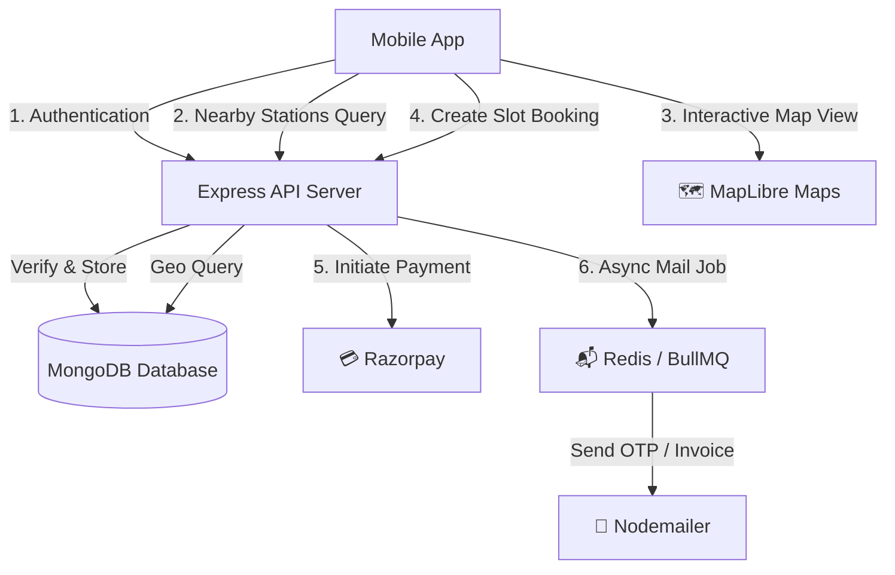

# EV Charging Application (Electrically) - Tech Stack & App Flow

Short and concise overview of the **Tech Stack** and **App Working Flow**.

---

## Technology Stack

| Layer | Technology Used | Description |
| :--- | :--- | :--- |
| **Mobile Frontend** | **React Native (v0.81)** & **Expo (v54)** | Cross-platform mobile application framework |
| **Routing** | **Expo Router (v6)** | File-based routing system (`/app`) |
| **Maps & Location** | **MapLibre React Native**, `expo-location` | Interactive maps and real-time user location |
| **Backend Runtime** | **Node.js (ES Modules)** & **Express.js (v5)** | REST API Server architecture |
| **Database** | **MongoDB** + **Mongoose (v9)** | Database for Users, Stations, Bookings & Sessions |
| **Caching & Session** | **Redis (ioredis)** + `connect-redis` | Session persistence (`ev:sess:`) and fast caching |
| **Background Queues** | **BullMQ** | Asynchronous email processing worker |
| **Auth & Security** | **JWT**, **Bcrypt**, `express-session`, **Helmet** | Authentication, password hashing, rate-limiting & security headers |
| **Payments** | **Razorpay API** | Online payment gateway integration |
| **Mailing** | **Nodemailer** | OTP verification and transactional emails |

---

## App Working Flow (ऐप कैसे काम करता है)



### Authentication Flow (ऑथेंटिकेशन)
1. User enters mobile number / email on **Welcome Screen**.
2. Server generates **OTP** -> Pushes job to **BullMQ** -> **Nodemailer** delivers email.
3. User enters OTP on **Verify Screen** -> Server returns **JWT Token** and initializes **Redis Session**.

### Station Discovery Flow (स्टेशन खोज)
1. App obtains device geolocation using `expo-location`.
2. Sends latitude & longitude to `/api/stations`.
3. Displays charging stations on an interactive **MapLibre Map** with filters (Connector type, Charging speed, Availability).

### Booking & Payment Flow (बुकिंग एवं भुगतान)
1. User selects a charging station and available time slot.
2. App sends booking request to `/api/bookings`.
3. Server creates order via **Razorpay**.
4. Upon successful payment verification, booking status updates in **MongoDB** to `CONFIRMED`.

### Partner Mode Flow (पार्टनर मोड)
1. Station providers toggle to **Partner Mode**.
2. Add, update, or manage charging ports and pricing.
3. View real-time charging sessions and earnings history.

---

## Project Structure Overview

```text
Ev/
├── mobile/               # React Native Expo Mobile App
│   ├── app/              # Expo Router pages ((auth), (tabs), partner.jsx)
│   ├── constants/        # Map styles, theme constants
│   ├── context/          # Global React context state
│   └── services/         # API client & Axios config
└── backend/              # Node.js Express API Server
    ├── src/
    │   ├── config/       # Environment & Redis config
    │   ├── controllers/  # Auth, Station, Booking controllers
    │   ├── database/     # MongoDB connection
    │   ├── models/       # Mongoose Schemas (User, Station, Booking, OTP, Session)
    │   ├── routes/       # Express route handlers
    │   └── services/     # BullMQ email worker
    └── server.js         # Entry point & Express middleware configuration
```
